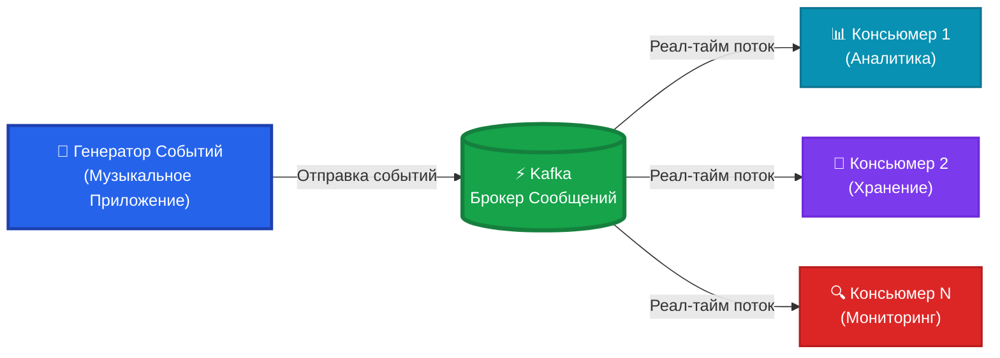
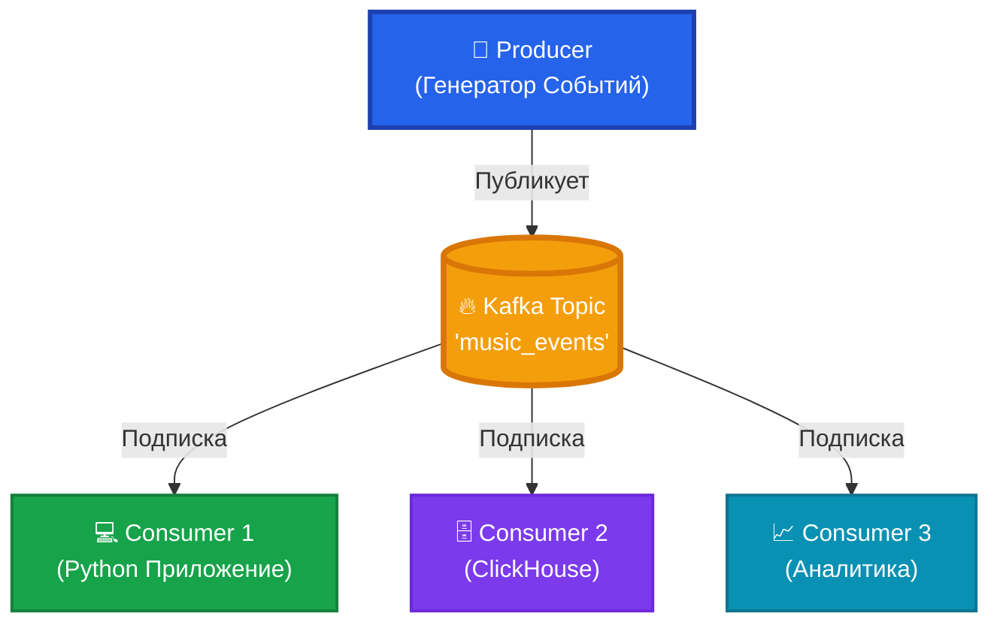
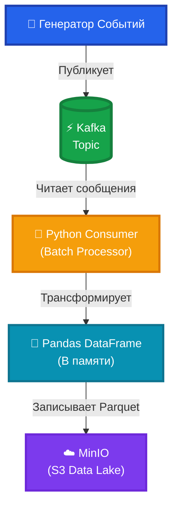
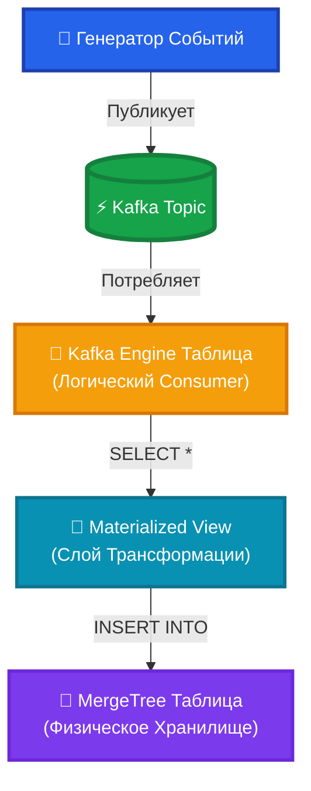

# Kafka Data Engineering project

Конвейер обработки событий в реальном времени для музыкального сервиса с использованием Kafka, Python, S3 (MinIO) и ClickHouse.

## Описание Проекта

Этот проект демонстрирует полный data engineering pipeline для сбора, хранения и анализа данных о действиях пользователей музыкальной платформы. Проект показывает современные паттерны event-driven архитектуры и обработки данных в реальном времени.

### Ключевые Возможности

- **Потоковая Обработка Событий**: Kafka как высокопроизводительный брокер сообщений
- **Множественные Стратегии Хранения**: Data Lake (MinIO/S3) и аналитическая БД (ClickHouse)
- **Реалистичная Генерация Событий**: Симуляция поведения пользователей с весовыми коэффициентами
- **Мониторинг Качества Данных**: Встроенные утилиты валидации и проверки партиций

---

##  Архитектура

### Общая Схема Системы



---

### Требования

- Python
- Docker
- Poetry

### Установка

#### 1️⃣ Создание Виртуального Окружения

```powershell
py -m venv venv && \
venv\Scripts\activate.ps1 && \
pip install --upgrade pip && \
pip install poetry && \
poetry lock && \
poetry install
```

#### 2️⃣ Добавление Новых Зависимостей (Опционально)

```bash
poetry add <имя-пакета>
poetry lock && poetry install
```

#### 3️⃣ Запуск Инфраструктуры

```bash
docker compose up -d
```

### Доступ к MinIO

Параметры по умолчанию:
- **Логин**: `minioadmin`
- **Пароль**: `minioadmin`
- **Консоль**: http://localhost:9001

---


Kafka — это распределённая платформа потоковой передачи событий, следующая принципу **Write Once, Read Many (WORM)**.

### Фундаментальные Принципы Kafka



---

##  Типы Событий

Система симулирует реалистичные события музыкального стриминга:

| ID | Название События          | Описание                  | Вес    |
|----|---------------------------|---------------------------|--------|
| 1  | `track_playback`          | Воспроизведение трека     | Высокий|
| 2  | `pause_track`             | Пауза трека               | Средний|
| 3  | `resume_track`            | Возобновление трека       | Средний|
| 4  | `skipping_track_next`     | Перелистывание вперёд     | Средний|
| 5  | `skipping_track_prev`     | Перелистывание назад      | Низкий |
| 6  | `adding_track_to_playlist`| Добавление в плейлист     | Низкий |
| 7  | `track_like`              | Лайк трека                | Средний|
| 8  | `track_unlike`            | Снятие лайка с трека      | Низкий |

---

##  Запуск Проекта

### 1️⃣ Простой Producer (Демо)

Генерация базовых событий в Kafka:

```bash
python code/simple_producer.py
```

**Просмотр сообщений в Kafka UI**: http://localhost:8080/

### 2️⃣ Генератор Событий Кликстрима

Запуск реалистичной симуляции событий музыкального стриминга:

```bash
python code/simple_clickstream.py
```

Скрипт генерирует взвешенные события от симулированных пользователей в топик `music_events`.

---

## Стратегии Сбора Данных

### Стратегия 1: Python + MinIO (Data Lake Подход)



**Запуск Python консьюмера**:

```bash
python code/kafka_to_minio_parquet_on_python.py
```

**Особенности**:
- Пакетная обработка с настраиваемым `BATCH_SIZE`
- Автоматическое партиционирование (по дате)
- Формат Parquet для эффективного хранения
- Идемпотентная запись

**Проверка Качества Данных**:

```bash
python code/check_count_partition_prod_python.py
```

Скрипт предоставляет:
1. Общее количество строк в bucket
2. Валидация схемы данных
3. Инспекция образцов данных (первые 10 событий `track_playback`)

---

### Стратегия 2: ClickHouse (Реал-тайм Аналитика)



#### Настройка ClickHouse

**Для топика `my_topic` (простые события)**:

```sql
-- Таблица-консьюмер (логическая)
CREATE TABLE kafka_simple_event_consumer
(
    uuid String,
    first_name String,
    last_name String,
    middle_name String,
    timestamp String
) ENGINE = Kafka SETTINGS
    kafka_broker_list = 'kafka',
    kafka_topic_list = 'my_topic',
    kafka_group_name = 'clickhouse_consumer',
    kafka_format = 'JSON';

-- Физическая таблица для хранения
CREATE TABLE kafka_simple_event_phys_table
(
    uuid String,
    first_name String,
    last_name String,
    middle_name String,
    timestamp String
)
ENGINE = MergeTree()
ORDER BY (uuid);

-- Материализованное представление для автоматической загрузки
CREATE MATERIALIZED VIEW kafka_simple_event_mat_view 
TO kafka_simple_event_phys_table 
AS SELECT * FROM kafka_simple_event_consumer;
```

**Для топика `music_events` (данные кликстрима)**:

```sql
-- Таблица-консьюмер
CREATE TABLE kafka_music_event_consumer
(
    event_params String,
    event_timestamp_ms String
) ENGINE = Kafka SETTINGS
    kafka_broker_list = 'kafka',
    kafka_topic_list = 'music_events',
    kafka_group_name = 'clickhouse_music_consumer',
    kafka_format = 'JSON';

-- Физическое хранилище с автогенерацией UUID
CREATE TABLE kafka_music_event_phys_table
(
    event_params String,
    event_timestamp_ms String,
    uuid UUID DEFAULT generateUUIDv4()
)
ENGINE = MergeTree()
ORDER BY (uuid);

-- Материализованное представление
CREATE MATERIALIZED VIEW kafka_music_event_mat_view 
TO kafka_music_event_phys_table 
AS SELECT * FROM kafka_music_event_consumer;
```

#### Примеры Запросов

**Просмотр всех событий**:
```sql
SELECT * FROM kafka_music_event_mat_view;
```

**Фильтрация по событиям воспроизведения треков**:
```sql
SELECT 
    JSONExtractString(event_params, 'user_id') AS user_id,
    JSONExtractString(event_params, 'track_id') AS track_id,
    event_timestamp_ms
FROM kafka_music_event_mat_view
WHERE JSONExtractInt(event_params, 'event_type_id') = 1
ORDER BY event_timestamp_ms DESC
LIMIT 100;
```

---

## 🔍 Команды Kafka CLI

### Просмотр Сообщений Без Consumer Group

```powershell
docker exec -it kafka kafka-console-consumer \
--bootstrap-server localhost:9092 \ 
--topic my_topic \
--from-beginning
```

### Просмотр Только Новых Сообщений

```bash
docker exec -it kafka kafka-console-consumer \
  --bootstrap-server localhost:9092 \
  --topic my_topic
```

### Consumer Group с Управлением Оффсетами

```bash
docker exec -it kafka kafka-console-consumer \
  --bootstrap-server localhost:9092 \
  --topic my_topic \
  --group mygroupcli
```

### Проверка Статуса Consumer Group

```bash
docker exec -it kafka kafka-consumer-groups \
  --bootstrap-server localhost:9092 \
  --group mygroupcli \
  --describe
```

---
