# Kafka Data Engineering Project

Real-time event processing pipeline for a music streaming service using Kafka, Python, S3 (MinIO), and ClickHouse.

## Project Description

This project demonstrates a complete data engineering pipeline for collecting, storing, and analyzing user activity data from a music streaming platform. It showcases modern event-driven architecture patterns and real-time data processing.

### Key Features

- **Streaming Event Processing**: Kafka as a high-performance message broker
- **Multiple Storage Strategies**: Data Lake (MinIO/S3) and analytical database (ClickHouse)
- **Realistic Event Generation**: User behavior simulation with weighted coefficients
- **Data Quality Monitoring**: Built-in validation and partition verification utilities

---

## Architecture

### System Overview

```mermaid
flowchart LR
    A["🎸 Event Generator<br/>(Music Application)"] -- Send events --> B[("⚡ Kafka<br/>Message Broker")]
    B -- Real-time stream --> C["📊 Consumer 1<br/>(Analytics)"]
    B -- Real-time stream --> D["💾 Consumer 2<br/>(Storage)"]
    B -- Real-time stream --> E["🔍 Consumer N<br/>(Monitoring)"]

    style A fill:#2563eb,stroke:#1e40af,stroke-width:3px,color:#fff
    style B fill:#16a34a,stroke:#15803d,stroke-width:4px,color:#fff
    style C fill:#0891b2,stroke:#0e7490,stroke-width:2px,color:#fff
    style D fill:#7c3aed,stroke:#6d28d9,stroke-width:2px,color:#fff
    style E fill:#dc2626,stroke:#b91c1c,stroke-width:2px,color:#fff
```



---

### Requirements

- Python
- Docker
- Poetry

### Installation

#### 1️⃣ Create Virtual Environment

```powershell
py -m venv venv && \
venv\Scripts\activate.ps1 && \
pip install --upgrade pip && \
pip install poetry && \
poetry lock && \
poetry install
```

#### 2️⃣ Add New Dependencies (Optional)

```bash
poetry add <package-name>
poetry lock && poetry install
```

#### 3️⃣ Launch Infrastructure

```bash
docker compose up -d
```

### MinIO Access

Default credentials:
- **Login**: `minioadmin`
- **Password**: `minioadmin`
- **Console**: http://localhost:9001

---

## Kafka Fundamentals

Kafka is a distributed event streaming platform following the **Write Once, Read Many (WORM)** principle.

### Kafka Core Principles

```mermaid
flowchart TB
    A["📱 Producer<br/>(Event Generator)"] -- Publishes --> B[("🔥 Kafka Topic<br/>'music_events'")]
    B -- Subscribes --> C["💻 Consumer 1<br/>(Python Application)"]
    B -- Subscribes --> D["🗄️ Consumer 2<br/>(ClickHouse)"]
    B -- Subscribes --> E["📈 Consumer 3<br/>(Analytics)"]

    style A fill:#2563eb,stroke:#1e40af,stroke-width:3px,color:#fff
    style B fill:#f59e0b,stroke:#d97706,stroke-width:4px,color:#fff
    style C fill:#16a34a,stroke:#15803d,stroke-width:2px,color:#fff
    style D fill:#7c3aed,stroke:#6d28d9,stroke-width:2px,color:#fff
    style E fill:#0891b2,stroke:#0e7490,stroke-width:2px,color:#fff
```



---

## Event Types

The system simulates realistic music streaming events:

| ID | Event Name                | Description              | Weight |
|----|---------------------------|--------------------------|--------|
| 1  | `track_playback`          | Track playback           | High   |
| 2  | `pause_track`             | Track pause              | Medium |
| 3  | `resume_track`            | Track resume             | Medium |
| 4  | `skipping_track_next`     | Skip forward             | Medium |
| 5  | `skipping_track_prev`     | Skip backward            | Low    |
| 6  | `adding_track_to_playlist`| Add to playlist          | Low    |
| 7  | `track_like`              | Like track               | Medium |
| 8  | `track_unlike`            | Unlike track             | Low    |

---

## Running the Project

### 1️⃣ Simple Producer (Demo)

Generate basic events to Kafka:

```bash
python code/simple_producer.py
```

**View messages in Kafka UI**: http://localhost:8080/

### 2️⃣ Clickstream Event Generator

Launch realistic music streaming event simulation:

```bash
python code/simple_clickstream.py
```

The script generates weighted events from simulated users to the `music_events` topic.

---

## Data Collection Strategies

### Strategy 1: Python + MinIO (Data Lake Approach)

```mermaid
flowchart TB
    A["🎵 Event Generator"] -- Publishes --> B[("⚡ Kafka<br/>Topic")]
    B -- Reads messages --> C["🐍 Python Consumer<br/>(Batch Processor)"]
    C -- Transforms --> D["🐼 Pandas DataFrame<br/>(In-memory)"]
    D -- Writes Parquet --> E["☁️ MinIO<br/>(S3 Data Lake)"]

    style A fill:#2563eb,stroke:#1e40af,stroke-width:3px,color:#fff
    style B fill:#16a34a,stroke:#15803d,stroke-width:4px,color:#fff
    style C fill:#f59e0b,stroke:#d97706,stroke-width:3px,color:#fff
    style D fill:#0891b2,stroke:#0e7490,stroke-width:3px,color:#fff
    style E fill:#7c3aed,stroke:#6d28d9,stroke-width:3px,color:#fff
```



**Run Python consumer**:

```bash
python code/kafka_to_minio_parquet_on_python.py
```

**Features**:
- Batch processing with configurable `BATCH_SIZE`
- Automatic partitioning (by date)
- Parquet format for efficient storage
- Idempotent writes

**Data Quality Verification**:

```bash
python code/check_count_partition_prod_python.py
```

The script provides:
1. Total row count in bucket
2. Data schema validation
3. Sample data inspection (first 10 `track_playback` events)

---

### Strategy 2: ClickHouse (Real-time Analytics)

```mermaid
flowchart TB
    A["🎵 Event Generator"] -- Publishes --> B[("⚡ Kafka Topic")]
    B -- Consumes --> C["🔄 Kafka Engine Table<br/>(Logical Consumer)"]
    C -- SELECT * --> D["🎯 Materialized View<br/>(Transformation Layer)"]
    D -- INSERT INTO --> E["💾 MergeTree Table<br/>(Physical Storage)"]

    style A fill:#2563eb,stroke:#1e40af,stroke-width:3px,color:#fff
    style B fill:#16a34a,stroke:#15803d,stroke-width:4px,color:#fff
    style C fill:#f59e0b,stroke:#d97706,stroke-width:3px,color:#fff
    style D fill:#0891b2,stroke:#0e7490,stroke-width:3px,color:#fff
    style E fill:#7c3aed,stroke:#6d28d9,stroke-width:3px,color:#fff
```



#### ClickHouse Configuration

**For `my_topic` topic (simple events)**:

```sql
-- Consumer table (logical)
CREATE TABLE kafka_simple_event_consumer
(
    uuid String,
    first_name String,
    last_name String,
    middle_name String,
    timestamp String
) ENGINE = Kafka SETTINGS
    kafka_broker_list = 'kafka',
    kafka_topic_list = 'my_topic',
    kafka_group_name = 'clickhouse_consumer',
    kafka_format = 'JSON';

-- Physical storage table
CREATE TABLE kafka_simple_event_phys_table
(
    uuid String,
    first_name String,
    last_name String,
    middle_name String,
    timestamp String
)
ENGINE = MergeTree()
ORDER BY (uuid);

-- Materialized view for automatic loading
CREATE MATERIALIZED VIEW kafka_simple_event_mat_view 
TO kafka_simple_event_phys_table 
AS SELECT * FROM kafka_simple_event_consumer;
```

**For `music_events` topic (clickstream data)**:

```sql
-- Consumer table
CREATE TABLE kafka_music_event_consumer
(
    event_params String,
    event_timestamp_ms String
) ENGINE = Kafka SETTINGS
    kafka_broker_list = 'kafka',
    kafka_topic_list = 'music_events',
    kafka_group_name = 'clickhouse_music_consumer',
    kafka_format = 'JSON';

-- Physical storage with auto-generated UUID
CREATE TABLE kafka_music_event_phys_table
(
    event_params String,
    event_timestamp_ms String,
    uuid UUID DEFAULT generateUUIDv4()
)
ENGINE = MergeTree()
ORDER BY (uuid);

-- Materialized view
CREATE MATERIALIZED VIEW kafka_music_event_mat_view 
TO kafka_music_event_phys_table 
AS SELECT * FROM kafka_music_event_consumer;
```

#### Query Examples

**View all events**:
```sql
SELECT * FROM kafka_music_event_mat_view;
```

**Filter by track playback events**:
```sql
SELECT 
    JSONExtractString(event_params, 'user_id') AS user_id,
    JSONExtractString(event_params, 'track_id') AS track_id,
    event_timestamp_ms
FROM kafka_music_event_mat_view
WHERE JSONExtractInt(event_params, 'event_type_id') = 1
ORDER BY event_timestamp_ms DESC
LIMIT 100;
```

---

## 🔍 Kafka CLI Commands

### View Messages Without Consumer Group

```powershell
docker exec -it kafka kafka-console-consumer \
--bootstrap-server localhost:9092 \ 
--topic my_topic \
--from-beginning
```

### View Only New Messages

```bash
docker exec -it kafka kafka-console-consumer \
  --bootstrap-server localhost:9092 \
  --topic my_topic
```

### Consumer Group with Offset Management

```bash
docker exec -it kafka kafka-console-consumer \
  --bootstrap-server localhost:9092 \
  --topic my_topic \
  --group mygroupcli
```

### Check Consumer Group Status

```bash
docker exec -it kafka kafka-consumer-groups \
  --bootstrap-server localhost:9092 \
  --group mygroupcli \
  --describe
```

---